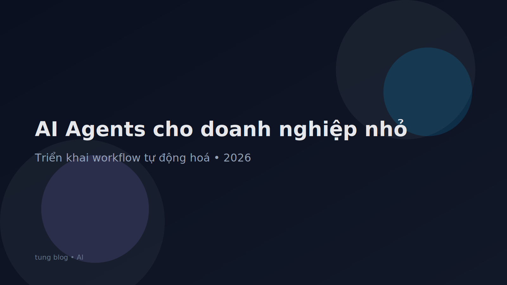

## AI Agents là gì và vì sao doanh nghiệp nhỏ nên quan tâm?

Nếu bạn từng dùng chatbot để trả lời câu hỏi cơ bản, **AI Agents** là bước tiếp theo: không chỉ “trả lời”, agent còn **tự lập kế hoạch và thực thi nhiều bước** để hoàn thành một mục tiêu như: tạo báo giá, theo dõi lead, nhắc lịch chăm sóc khách hàng, tổng hợp báo cáo cuối ngày.

Điểm khác biệt nằm ở 3 năng lực:

- **Nhận mục tiêu (goal)**: “tạo báo giá cho khách A”, “tóm tắt cuộc họp”, “lên danh sách việc cần làm”.
- **Lập kế hoạch (plan)**: tách mục tiêu thành các bước nhỏ.
- **Thực thi (act)**: gọi công cụ (email, Google Sheets, CRM, calendar), truy vấn dữ liệu, tạo tài liệu.

Với **doanh nghiệp nhỏ**, agent thường mang lại hiệu quả rõ nhất ở những công việc lặp lại: trả lời khách, nhập liệu, theo dõi đơn, tổng hợp số liệu.

## 5 use case dễ triển khai và “ra tiền” nhanh

### 1) Agent tư vấn & chốt đơn trên website/Facebook
Agent có thể:
- Trả lời câu hỏi sản phẩm theo kịch bản.
- Gợi ý sản phẩm phù hợp nhu cầu.
- Xin số điện thoại/email để tạo lead.
- Đẩy lead vào Google Sheets/CRM.

SEO tip: tạo trang FAQ theo đúng câu hỏi khách hay hỏi, sau đó dùng nội dung này làm dữ liệu cho agent.

### 2) Agent chăm sóc khách hàng sau mua (CSKH)
Tự động:
- Gửi hướng dẫn sử dụng.
- Nhắc bảo hành/bảo trì.
- Hỏi mức độ hài lòng.
- Gợi ý mua thêm (upsell/cross-sell).

### 3) Agent xử lý email & phân loại yêu cầu
Nếu bạn nhận 50–200 email/ngày, agent có thể:
- Tóm tắt nội dung.
- Gắn nhãn (khiếu nại, báo giá, hợp tác, nội bộ).
- Soạn draft trả lời.
- Tạo ticket cho từng yêu cầu.

### 4) Agent tạo nội dung marketing “theo quy trình”
Agent không chỉ viết bài, mà có thể chạy chuỗi bước:
- Nghiên cứu từ khóa.
- Lập dàn ý.
- Viết bài.
- Tạo checklist SEO onpage.
- Gợi ý tiêu đề và meta description.

### 5) Agent tổng hợp báo cáo vận hành
Ví dụ cuối ngày agent tự:
- Lấy dữ liệu đơn hàng từ Sheet.
- Tính doanh thu, tỉ lệ hoàn.
- So sánh tuần trước.
- Xuất báo cáo 1 trang.

## Kiến trúc tối giản để doanh nghiệp nhỏ triển khai

Bạn không cần xây hệ thống phức tạp ngay từ đầu. Lộ trình tối giản có thể là:

1. **Nguồn dữ liệu**: Google Drive/Docs, Notion hoặc 1 folder “tài liệu chuẩn”.
2. **Công cụ**: Google Sheets, Gmail, Calendar, CRM (HubSpot/Zoho), Zalo OA/Facebook.
3. **Agent**: một lớp logic “đọc dữ liệu + làm việc theo luật”.
4. **Bảo vệ**: phân quyền, log hoạt động, quy tắc không làm.

Nếu bạn làm nội dung nhiều, hãy ưu tiên thêm bước **RAG (retrieval)** để agent trả lời theo tài liệu nội bộ thay vì “bịa”.

## Checklist 30 ngày triển khai AI Agents (thực tế, dễ làm)

### Tuần 1: Chọn use case và đo baseline
- Chọn 1 quy trình lặp lại (VD: trả lời 20 câu hỏi/ ngày).
- Ghi lại thời gian hiện tại (baseline).
- Chuẩn hóa dữ liệu: tạo “bảng câu hỏi – câu trả lời” dạng FAQ.

### Tuần 2: Thiết kế workflow
- Xác định đầu vào (form/chat/email).
- Xác định đầu ra (sheet, CRM, email).
- Viết “luật” (agent được/không được làm gì).

### Tuần 3: Triển khai bản MVP
- Kết nối công cụ tối thiểu.
- Chạy thử nội bộ.
- Theo dõi lỗi (sai thông tin, trả lời lạc đề, trùng lead).

### Tuần 4: Tối ưu & đo ROI
- So sánh thời gian trước/sau.
- Đo tỉ lệ chốt / tỉ lệ hài lòng.
- Chuẩn hóa thêm dữ liệu để agent trả lời tốt.

## Những lỗi hay gặp (và cách tránh)

1) **Không có dữ liệu chuẩn** → agent trả lời sai.
- Giải pháp: tạo bộ tài liệu “nguồn chuẩn” (policy, giá, bảo hành, hướng dẫn).

2) **Đặt kỳ vọng quá cao** → muốn agent làm “mọi thứ”.
- Giải pháp: bắt đầu từ 1 nhiệm vụ, mở rộng dần.

3) **Không có cơ chế kiểm soát** → agent gửi nhầm email, tạo nhầm đơn.
- Giải pháp: bật chế độ “draft trước”, hoặc yêu cầu xác nhận với tác vụ quan trọng.

## Kết luận

Năm 2026, lợi thế của doanh nghiệp nhỏ không nằm ở việc mua phần mềm đắt nhất, mà ở **khả năng biến quy trình lặp lại thành workflow tự động**. AI Agents là công cụ phù hợp vì triển khai linh hoạt, mở rộng được và hiệu quả rõ ràng.

Nếu bạn muốn bắt đầu nhanh: hãy chọn **1 quy trình lặp lại nhất**, chuẩn hóa dữ liệu và làm MVP trong 30 ngày. Khi đã có kết quả, việc mở rộng sang bán hàng, CSKH và báo cáo sẽ dễ hơn rất nhiều.

