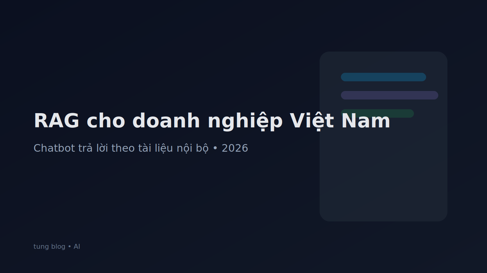

## RAG là gì và vì sao doanh nghiệp nên triển khai?

Trong thực tế, doanh nghiệp không thiếu “AI”, doanh nghiệp thiếu **câu trả lời đúng** theo chính sách, giá, quy trình và tài liệu nội bộ. Đây là lý do **RAG (Retrieval‑Augmented Generation)** trở thành lựa chọn phổ biến: thay vì bắt model “tự nghĩ”, hệ thống sẽ **đi lấy đúng đoạn tài liệu liên quan**, rồi mới tạo câu trả lời dựa trên nguồn đó.

Khi làm đúng, RAG giúp:

- Giảm hiện tượng **hallucination** (bịa thông tin).
- Tăng khả năng **trích dẫn nguồn** (nói rõ đoạn nào trong tài liệu).
- Dễ cập nhật: đổi tài liệu là cập nhật kiến thức.
- Dễ kiểm soát bảo mật: phân quyền theo nhóm tài liệu.

## Khi nào RAG là lựa chọn tốt (vs fine-tune)?

RAG phù hợp nếu:
- Dữ liệu thay đổi thường xuyên (giá, policy, quy trình).
- Bạn cần câu trả lời “đúng theo văn bản”.
- Bạn có nhiều định dạng tài liệu: PDF, DOCX, wiki, email.

Fine-tune phù hợp hơn nếu:
- Bạn muốn thay đổi phong cách/giọng văn.
- Bạn có dataset Q&A chuẩn, ổn định.

Nhiều doanh nghiệp làm kết hợp: **RAG để kiến thức**, fine-tune/prompt để “giọng”.

## Kiến trúc RAG tối giản (dễ triển khai)

Một pipeline RAG cơ bản gồm:

1) **Ingest**: thu thập tài liệu (Drive/SharePoint/Notion).
2) **Parse**: trích xuất text, giữ cấu trúc heading/bảng.
3) **Chunking**: cắt tài liệu thành đoạn nhỏ có ngữ cảnh.
4) **Embedding**: biến mỗi chunk thành vector.
5) **Vector DB**: lưu và truy vấn theo độ tương đồng.
6) **Retriever**: lấy top‑k đoạn liên quan.
7) **Generator**: trả lời dựa trên đoạn đã lấy.
8) **Guardrails**: luật bảo mật + format + trích dẫn.

## Chunking: bước quyết định “chatbot trả lời có đúng không”

Chunking sai là nguyên nhân số 1 khiến RAG trả lời kém.

Gợi ý thực chiến:
- Chunk theo **heading** (H2/H3) thay vì cắt theo số ký tự mù.
- Mỗi chunk nên có **ngữ cảnh**: tên tài liệu, chương, mục.
- Dùng overlap nhẹ (10–15%) để không mất liên kết câu.

Nếu tài liệu nhiều bảng giá, hãy giữ cấu trúc bảng (hoặc convert sang markdown) để model đọc đúng.

## Trích dẫn nguồn: bắt buộc để “chuẩn doanh nghiệp”

Nếu bạn dùng RAG cho CSKH/nhân sự/tuân thủ, nên yêu cầu câu trả lời:

- Luôn có mục **Nguồn** liệt kê tài liệu + đoạn trích.
- Nếu không tìm thấy nguồn đủ chắc chắn, phải trả lời: “Chưa có thông tin trong tài liệu hiện tại”.

Đây là cách bạn biến chatbot thành công cụ **đáng tin**.

## Bảo mật & phân quyền (đừng bỏ qua)

Một chatbot nội bộ cần ít nhất:
- Phân quyền theo phòng ban (HR, Sales, Legal).
- Log truy vấn (ai hỏi gì, khi nào).
- Chặn dữ liệu nhạy cảm (lương, hợp đồng) với người không có quyền.

Mẹo: tách vector index theo “nhóm quyền” để tránh rò rỉ từ gốc.

## Đo chất lượng: 4 chỉ số nên theo dõi

1) **Answer correctness**: trả lời đúng theo nguồn.
2) **Citation rate**: % câu trả lời có trích dẫn.
3) **Refusal rate**: % từ chối khi thiếu dữ liệu (tốt nếu tăng trong giai đoạn đầu).
4) **Cost per resolved ticket**: chi phí/1 vấn đề giải quyết.

## Checklist triển khai RAG trong 14 ngày

- Ngày 1–2: chọn 1 use case (VD: CSKH sản phẩm A).
- Ngày 3–4: gom tài liệu nguồn + chuẩn hóa format.
- Ngày 5–7: pipeline ingest + chunk + embedding.
- Ngày 8–10: UI chat + citations.
- Ngày 11–14: test theo bộ câu hỏi thật + chỉnh chunking.

## Kết luận

RAG không phải “trend”, mà là cách thực tế để doanh nghiệp dùng AI **mà vẫn kiểm soát được sự thật**. Nếu bạn bắt đầu từ 1 use case nhỏ, có dữ liệu sạch và cơ chế trích dẫn, bạn sẽ thấy hiệu quả rõ rệt trong CSKH và vận hành.

