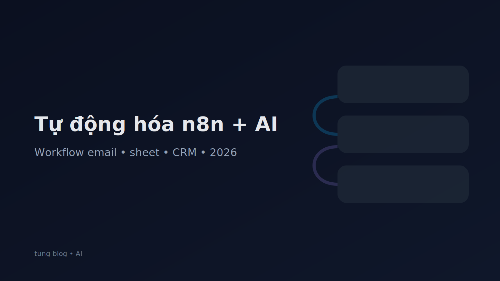

## Vì sao n8n + AI là combo mạnh cho doanh nghiệp nhỏ?

Năm 2026, nhiều doanh nghiệp đã dùng AI để viết nội dung hoặc trả lời chat, nhưng vẫn mắc kẹt ở chỗ: **AI không tự chảy vào quy trình**. n8n giải quyết vấn đề này bằng cách làm “xương sống” automation: nhận trigger → xử lý → gọi AI → ghi kết quả ra công cụ bạn đang dùng.

Điểm mạnh của n8n:
- Kết nối nhiều hệ thống (Gmail, Sheets, Notion, Slack, webhook…).
- Chạy on‑premise (tự host) nếu bạn cần bảo mật.
- Dễ version workflow, dễ debug.

## 7 workflow n8n + AI đáng triển khai nhất

### 1) Tóm tắt email và tạo việc cần làm
Trigger: email đến hộp thư chung.
Flow:
- Lấy nội dung email
- Gọi AI tóm tắt 3 gạch đầu dòng
- Tạo task (Notion/Trello) + deadline

### 2) Phân loại yêu cầu khách hàng (ticket triage)
Trigger: form/website chat.
Flow:
- AI phân loại: báo giá / hỗ trợ / khiếu nại
- Gán priority
- Đẩy vào hệ thống ticket

### 3) Đồng bộ lead vào CRM + gợi ý kịch bản gọi
Trigger: lead mới trong Google Sheets.
Flow:
- Chuẩn hóa số điện thoại, nguồn
- AI gợi ý 5 câu hỏi mở đầu
- Tạo contact trong CRM

### 4) Tổng hợp báo cáo cuối ngày
Trigger: 18:00 hàng ngày.
Flow:
- Lấy số liệu (doanh thu, đơn, tỉ lệ hoàn)
- AI viết nhận xét: tăng/giảm, nguyên nhân giả định
- Gửi email báo cáo

### 5) Viết nháp bài social theo lịch
Trigger: lịch nội dung tuần.
Flow:
- AI tạo 3 biến thể caption
- Tạo checklist: hashtag, CTA
- Lưu vào Notion để duyệt

### 6) Cảnh báo KPI bất thường
Trigger: cron mỗi 30 phút.
Flow:
- Đọc KPI
- Nếu giảm mạnh → AI giải thích khả năng
- Gửi cảnh báo Slack/Zalo

### 7) Làm sạch dữ liệu khách hàng định kỳ
Trigger: hàng tuần.
Flow:
- Xóa trùng
- Chuẩn hóa tỉnh/thành
- AI gợi ý trường dữ liệu thiếu

## Prompt “chuẩn workflow” (để AI trả output ổn định)

Mẹo quan trọng: trong automation, bạn cần output nhất quán. Hãy yêu cầu AI trả JSON.

Ví dụ prompt:
- Trả về JSON gồm: summary, category, priority, next_action.
- Không thêm văn bản ngoài JSON.

Điều này giúp workflow ít lỗi.

## Bảo mật khi dùng n8n + AI

- Không đưa dữ liệu nhạy cảm vào prompt nếu không cần.
- Mask thông tin (email/phone) trước khi gửi AI.
- Ghi log các lần AI quyết định.
- Với tác vụ quan trọng (gửi mail, đổi giá), hãy yêu cầu bước “approve”.

## Checklist triển khai trong 1 tuần

Ngày 1: Chọn 1 workflow “đau nhất”.

Ngày 2: Vẽ flow, xác định input/output.

Ngày 3: Làm bản chạy được (MVP).

Ngày 4–5: Thêm guardrails + logging.

Ngày 6–7: Đo thời gian tiết kiệm và chuẩn hóa.

## Kết luận

n8n + AI không chỉ giúp “làm nhanh”, mà giúp doanh nghiệp **chạy quy trình ổn định**: ai làm gì, khi nào, output ở đâu. Bắt đầu từ 1 workflow nhỏ, bạn sẽ thấy hiệu quả ngay, rồi mở rộng dần sang CSKH, sales và báo cáo.

